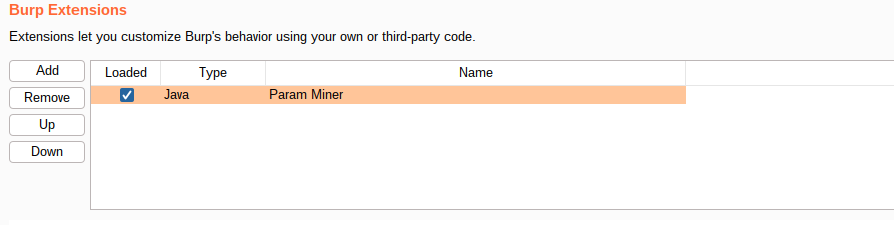
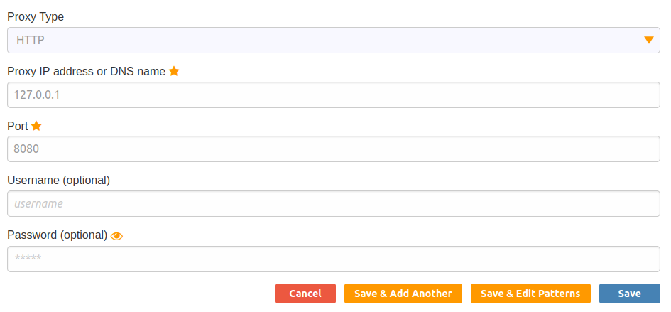
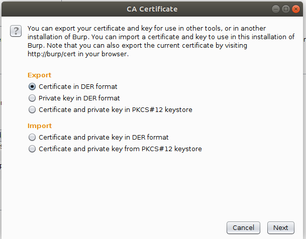
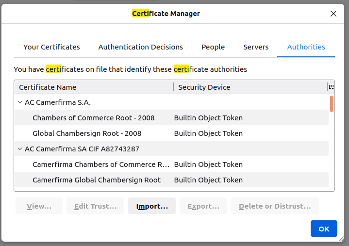

# Cache Poisoning - Proof of Concept

## Setup:
1. First of all we need to install Burp Suite, a very popular tool for web exploiting.
2. The second step is to install Param Miner, a plugin for Burp Suite which allows us to find unkeyed entries in HTTP requests.
Under `Extender` -> `Extensions` -> `BApp Store` install Param Miner.
You can then see the extension installed in the `Extender`->`Extension` tab:
	
3. To redirect the traffic of our browser to Burp Suite we need to install FoxyProxy. This can easily be done in firefox using mozila addons.
4. Burp Suite will run on localhost port 8080, so we need to configure FoxyProxy to 
redirect traffic to Burp Suite. We do that in the `Options` tab from FoxyProxy by completing the following:
	
After that, Burp Suite can be used as a proxy for your browser.
It should be noted that by default no proxy is activated, so when we want to use Burp Suite we 
need to select it from FoxyProxy's list.
5. To allow HTTPS traffic to be intercepted, we need to generate a certificate from Burp Suite and import it into our browser's trusted list.

	

	
