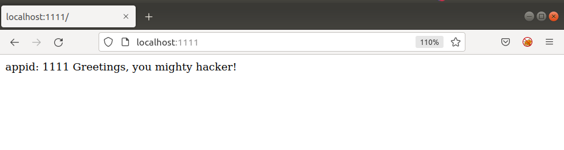
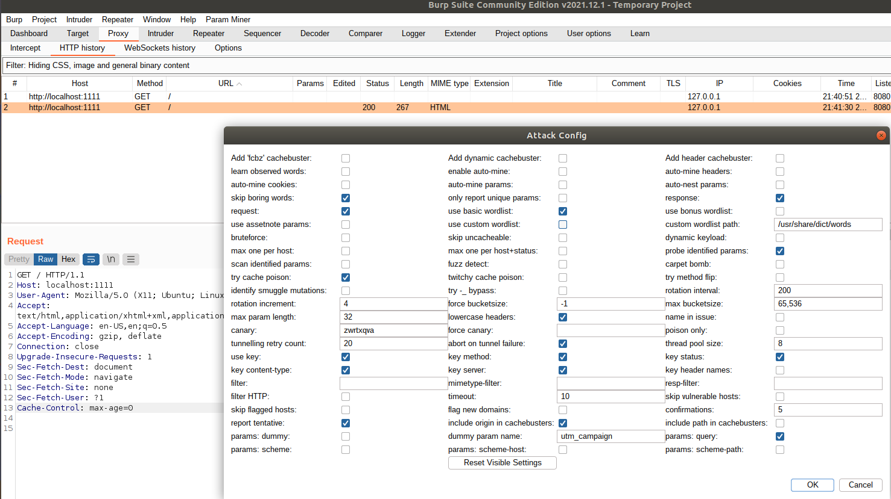
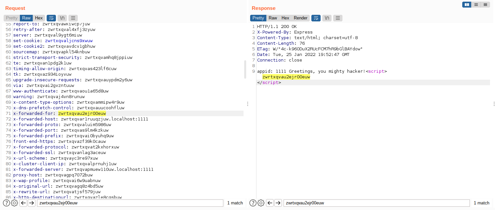
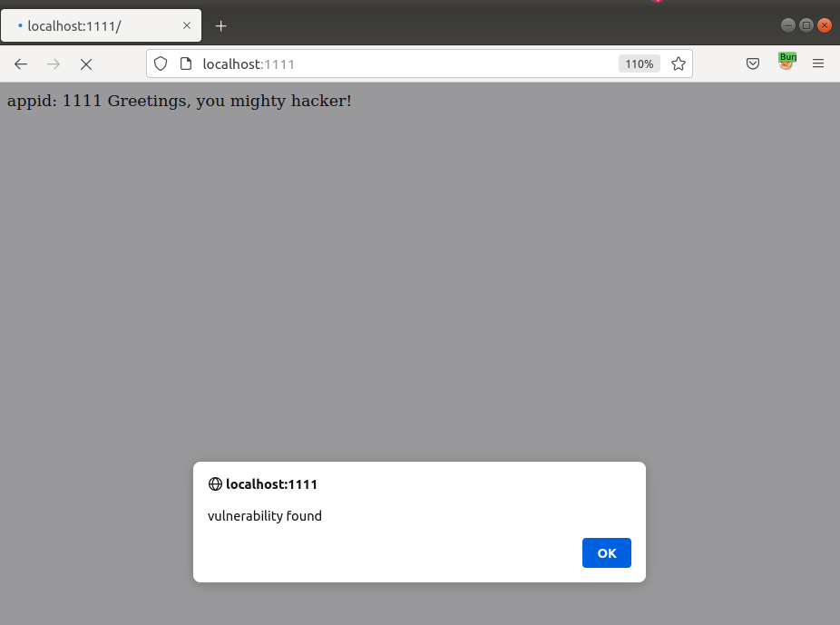

# Cache Poisoning - Proof of Concept

## Setup:
1. First of all we need to install Burp Suite, a very popular tool for web exploiting.
2. The second step is to install Param Miner, a plugin for Burp Suite which allows us to find unkeyed entries in HTTP requests.
Under `Extender` -> `Extensions` -> `BApp Store` install Param Miner.
You can then see the extension installed in the `Extender`->`Extension` tab:
	
3. To redirect the traffic of our browser to Burp Suite we need to install FoxyProxy. This can easily be done in firefox using mozila addons.
4. Burp Suite will run on localhost port 8080, so we need to configure FoxyProxy to 
redirect traffic to Burp Suite. We do that in the `Options` tab from FoxyProxy by completing the following:
	
After that, Burp Suite can be used as a proxy for your browser.
It should be noted that by default no proxy is activated, so when we want to use Burp Suite we 
need to select it from FoxyProxy's list.
5. To allow HTTPS traffic to be intercepted, we need to generate a certificate from Burp Suite and import it into our browser's trusted list.

	

	

6. To run the vulnerable web application we will need to install node.js and npm

## Exploit:
1. Run the vulnerable web application:
```
$ cd app
$ npm install
$ export APPID=1111 && node index.js
```
The web page should look as follows:
	

2. Start Burp Suite and also select it as a proxy from FoxyProxy's list.

3. Go into `Proxy` -> `HTTP history` tab and select the GET request for our vulnerable app.
Right Click on it and select the `Get Headers Option`.
Now we will use Param Miner to get the unkeyed inputs:

	

4. Param Miner will give us all the unkeyed parameters from the header. After
inspecting the GET responses we find the vulnerability:

	

5. All we have left to do is to acctually run the attack. In the `Proxy` -> `HTTP History` select the GET request.
Right Click on it and select `Send it to repeater`.
Add the following line at the end of the request:
 ```
 x-forwarded-for: alert("vulnerability found")
 ```
Send the crafted request and refresh the web page of the app.
The result:
	